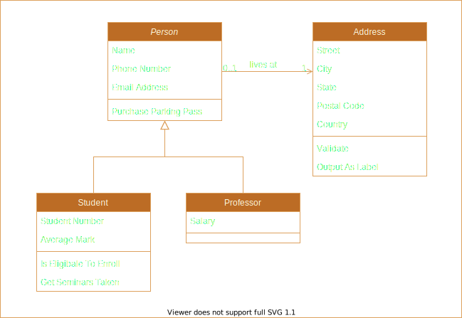

# Contributing to OBS Chatbot
## Issues
Issues are used both by developers to track work, and by others to file problems or suggestions.
Use the `improvement` or `bug` labels for help requests, and use other labels as appropriate for 
development work. Nothing should go unlabeled!

## Branches
**Contact me first (contact (at) tinatiel.com)**, as currently I'm the only one contributing, so my changes are going 
directly the `main` branch. Should we work together, I suggest these conventions:
 - `topic-#XX-...` for branches working a GitHub issue
 - `feature-...` for features that incorporate many issues/topics
 - `release-Major.Minor.Patch` for release branches that incorporate many features
   
## Versioning
Please follow SemVer 2.0 for versions, e.g.:

`major.minor.patch-prerelease+buildmetadata`

For pre-releases, bear in mind that version ordering applies. So, try to avoid using singular words
and instead stick to numbers so that they order in a predictable way:

`1.2.3-1.0.0+adding-new-feature`

Please do not break this convention with versions such as "1.2.3.4".

## Documentation
### Diagrams
You can use Draw.io to save/edit SVG files, and commit them directly to the wiki
repository. You can them reference them in markdown files like normal images.

Since GitHub has both folks using light-mode and dark-mode in their browsers, please
ensure you use a color scheme that works well with both. This typically would be:
 - Orange colors
 - Drop Shadows

You can also use no-fill shapes to better center/bound the image when displayed.
A full example is available below:
``

